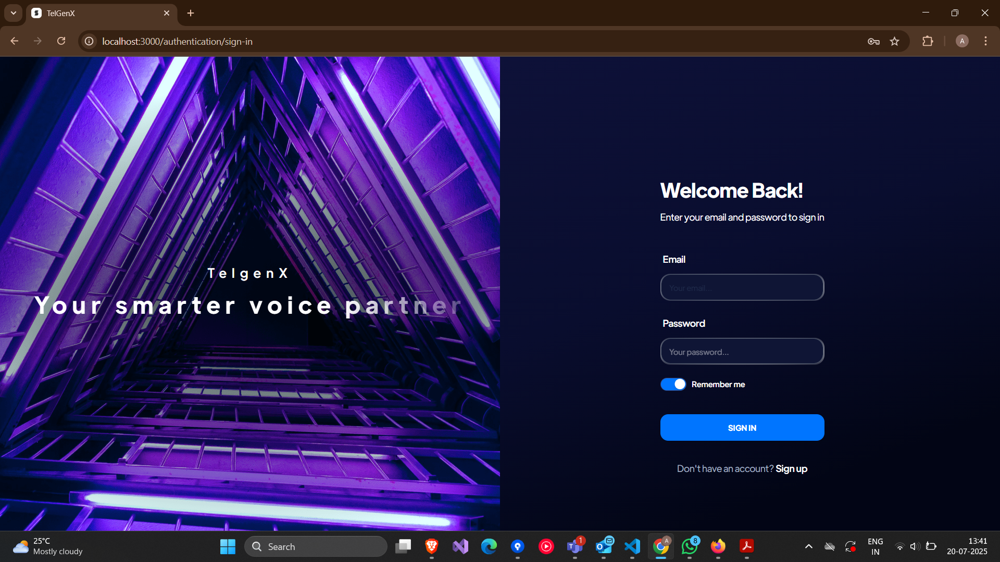

🚀 Title: TelGenX
🧾 Basic Details:
TelGenX is a fully customizable AI-powered voice assistant that replaces traditional IVR systems. It uses dynamic prompt-based conversation threads to enable seamless, human-like customer interactions over voice calls.

👥 Team Name: TelGenX
Team Members:

Vishnuprasad K R

Vishnu N K

Seetha R

Viveka

🧭 Track:
AI + Communication Automation (or specify your exact hackathon track if available)

❓ Problem Statement:
Current IVR-based call systems suffer from:

Poor customer experience due to robotic and rigid flow

Long wait times and menu complexity

Lack of real-time understanding or personalization

No easy integration with modern platforms (Telegram, WhatsApp, CRMs, etc.)

✅ Solution – TelGenX:
A plug-and-play AI Voice Assistant to replace outdated IVR.
TelGenX:

Listens and responds to users in real time via phone calls

Handles custom instructions (prompts) dynamically using GPT-based voice tech

Connects to external systems (e.g., CRM, WhatsApp, Telegram, databases) via n8n

Provides multi-language, emotion-aware, and prompt-driven voice conversations

Supports easy fallback options like sending summary via Telegram/WhatsApp

🛠 Project Description:
TelGenX is a voice-first intelligent assistant built on top of:

Vapi: for real-time voice interaction and telephony

Deepgram (Nova): for high-accuracy transcription

OpenAI GPT-4o: for understanding user intent and generating natural responses

n8n: for triggering workflows (e.g., sending messages, connecting to CRMs)

Telegram Bot API: to continue the interaction visually after the call (e.g., sending receipts, reports, summaries)

TelGenX transforms the customer support flow from “Press 1 to…” to “How can I help you today?”

💻 Technical Details
🔧 Tech Stack & Libraries
Frontend (Optional Dashboard): React + Vite + Tailwind

Voice Assistant Backend:

Vapi: For voice bot calls

Deepgram Nova: Speech-to-text (paid)

OpenAI GPT-4o: AI response generation

n8n: No-code automation engine (Webhook, Telegram, WhatsApp flows)

🏃‍♂️ Installation and Execution Instructions:
Clone repo & install dependencies

bash
Copy
Edit
git clone https://github.com/VishnuPrasad2000/Hackathon.git

cd telgenx
npm install
Update the Config with a valid Vapi Key
npm run start
n8n setup

Create webhook to receive call events
Connect to Telegram or WhatsApp nodes
Send summaries or file attachments as needed

ScreenShots

 
  

